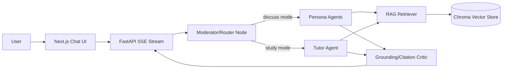

# Aloof from the World

Learn, study, and discuss philosophy, psychology, and history through conversations
with the great thinkers — every reply grounded in passages retrieved from their
actual books.

A hybrid **multi-agent** system: persona agents (Socrates, Nietzsche, Freud,
Confucius — or a moderated roundtable of several at once) orchestrated by workflow
agents (router/moderator, RAG retriever, grounding critic, study tutor).

## Architecture



- **Discuss mode**: talk with one thinker, or select up to 3 for a roundtable where
  they respond in turn and react to each other. Mention a persona by name to direct
  a question at them.
- **Study mode**: a tutor explains topics, asks Socratic questions, and generates
  quizzes — all from the same corpus.
- **Grounding**: each reply is checked by a critic node and ships with clickable
  citations to the exact corpus passages it used.

## Stack

| Layer     | Tech |
|-----------|------|
| Backend   | Python 3.12+, FastAPI, LangGraph, LangChain |
| RAG       | Chroma (persistent), configurable embeddings |
| LLMs      | Ollama (local, default) · OpenAI · Anthropic — switch via env |
| Corpus    | 15 public-domain works from Project Gutenberg, 11k+ indexed passages |
| Frontend  | Next.js (React, Tailwind), SSE streaming chat |
| Storage   | SQLite (sessions & messages) |

## Quickstart

Prereqs: [uv](https://docs.astral.sh/uv/), Node 22+, and
[Ollama](https://ollama.com) (for the default local-LLM setup).

```bash
# 1. Install dependencies
make setup

# 2. Pull a chat model (or edit backend/.env to match one you have)
ollama pull llama3.2
ollama serve            # if the daemon isn't already running

# 3. Configure (defaults work out of the box)
cp backend/.env.example backend/.env

# 4. Ingest the corpus (one-time, ~10 min: downloads + embeds 15 works)
make ingest

# 5. Run (two terminals)
make backend            # FastAPI on :8000
make frontend           # Next.js on :3000
```

Open http://localhost:3000.

Try it in the terminal instead:

```bash
make repl                                        # Socrates, discuss mode
cd backend && uv run python -m app.cli --mode study
cd backend && uv run python -m app.cli --personas socrates,nietzsche,freud
```

## Using OpenAI or Anthropic instead

Edit `backend/.env`:

```bash
LLM_PROVIDER=openai            # or anthropic
OPENAI_API_KEY=sk-...
# ANTHROPIC_API_KEY=sk-ant-...
```

Embeddings default to `chroma-default` (bundled local MiniLM, zero config). If you
switch `EMBEDDING_PROVIDER`, re-run `make ingest` — embedding spaces are not
compatible across providers.

## Optional: Redis cache

Retrieval results and critic responses can be cached in Redis to cut repeat-query
latency. It is off by default — set `REDIS_URL` in `backend/.env` to enable:

```bash
docker run -d -p 6379:6379 redis:7-alpine   # or use the compose stack
# backend/.env
REDIS_URL=redis://localhost:6379/0
```

If Redis is unreachable the app simply runs uncached. Re-running `make ingest`
flushes stale retrieval entries automatically.

## Add a new thinker

Personas are data, not code. Drop a YAML card into `backend/app/personas/`:

```yaml
id: marcus
name: Marcus Aurelius
era: Roman Empire, 121-180 AD
tradition: Stoicism
color: amber
authors: [Marcus Aurelius]      # matched against corpus metadata
traditions: [Stoicism]          # fallback scope for retrieval
greeting: "Waste no more time arguing what a good man should be. Be one."
voice: You are Marcus Aurelius, emperor and Stoic...
worldview: ...
style_rules:
  - Speak in short meditative reflections.
```

`authors`/`traditions` scope that persona's retrieval to their own works. If the
works aren't in the corpus yet, add them to `backend/app/rag/corpus.yaml` and
re-run `make ingest` (Gutenberg id only; ingestion is idempotent per work).

## Docker

```bash
make docker      # builds backend + frontend + redis; mounts ./data for the vector store
```

Ollama stays on the host; the backend reaches it via `host.docker.internal`. The
compose stack includes a Redis service and wires `REDIS_URL` automatically.

## Tests

```bash
make test        # backend: 36 tests (RAG, personas, critic, graph, API — fakes, no keys needed)
                 # frontend: eslint + 8 component tests (Vitest + Testing Library)
```

## Project layout

```
backend/
  app/
    agents/      # LangGraph: router, personas, retriever, tutor, critic, graph
    personas/    # YAML persona cards (one file per thinker)
    rag/         # corpus.yaml manifest, loaders, Chroma store, ingest CLI
    api/         # SSE chat streaming, sessions, library
    db.py        # SQLite persistence
    cli.py       # terminal REPL
frontend/
  src/app/       # chat page + library page
  src/components/# sidebar, persona picker, message list, composer
data/            # corpus cache, Chroma vector store, SQLite db
```
